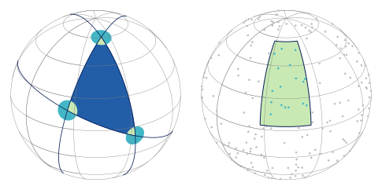

# plot_tools
A sporadically growing collection of code snippets for plotting and creating sketches with matplotlib.

## Current features:
* Spherical sketches
* Obtaining a small set of colors from a color map


# Supplies:
The **plot_tools** module which exposes the following methods:
```python
    get_cm_colors(colormap, n_colors):
        # Obtain a number 'n_colors' of colors from a colormap
        # named 'colormap'.

```

# Requires:
* matplotlib
* numpy

# Installation:
Install with pip inside the root folder:
```bash
    pip install .
```
